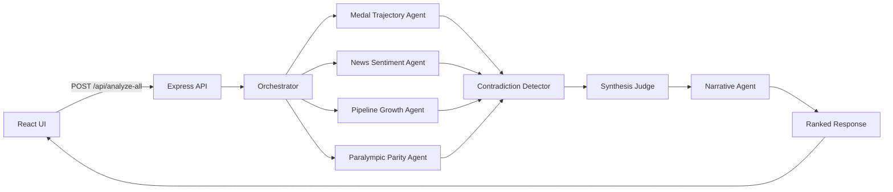

# Team USA LA28 Momentum Tracker

Team USA LA28 Momentum Tracker is a fan-facing hackathon app for the Team USA x Google Cloud Hackathon, built for Challenge 3: “The Road to LA28 Games Bracket.” The current build has moved beyond the original single-sport MVP into a synthesis-driven momentum board that ranks Team USA sports, runs a multi-agent Gemini analysis pipeline, and presents the results in a more editorial, analyst-style interface.

The app is intentionally still a hackathon build. It runs as a single Cloud Run service, uses Gemini for structured reasoning and narrative generation, and keeps a curated local JSON dataset as the source of truth. Firestore is intentionally deferred for now.

## Current Product State

The codebase currently includes:

- A redesigned React + Vite frontend with a hero, agent-status strip, tiered momentum board, and right-side detail panel
- A Node.js + Express backend that serves both API routes and the production React build
- Deterministic momentum scoring in `server/utils/score.js`
- A legacy single-sport Gemini route at `POST /api/analyze`
- A new multi-agent full-board route at `POST /api/analyze-all`
- Friendly UI error handling for quota, billing, API enablement, and network failures
- Google Cloud Run deployment support
- A GitHub Actions CI/CD workflow scaffold for validation and deploys

Intentionally deferred:

- Firestore persistence or caching
- Live ingestion pipelines or scheduled refresh jobs
- SSE or streaming agent updates
- Authentication, accounts, or admin tooling

## Frontend Experience

The current UI no longer behaves like the original leaderboard-plus-detail MVP. It now acts more like an AI analyst board:

- The board auto-runs full momentum analysis after the sports dataset loads
- Sports are grouped into `High momentum`, `Rising`, and `Building` tiers
- A compact agent strip shows the multi-agent system progressing through the run
- The detail panel highlights the selected sport’s composite score, confidence interval, agent signals, contradiction status, narrative, and parity note
- User-facing failures are shown as friendly toast messages instead of raw backend errors
- Clicking a different sport clears the current toast so the interface recovers cleanly

## Agent Orchestration

The backend now includes a multi-agent orchestration flow behind `POST /api/analyze-all`.



### Agent Responsibilities

- `orchestrator.js`: prepares the full analysis pass
- `medalTrajectory.js`: evaluates performance continuity and momentum trend framing
- `newsSentiment.js`: measures public visibility and headline energy from the curated dataset
- `pipelineGrowth.js`: evaluates developmental depth and future-facing pipeline strength
- `paralympicParity.js`: adds parity-aware reasoning so Paralympic sports are handled with equal seriousness
- `contradictionDetector.js`: flags disagreements between specialist signals
- `synthesisJudge.js`: merges agent outputs into ranked scores and confidence intervals
- `narrative.js`: turns ranked synthesis into fan-friendly sport narratives and momentum tier language

### Runtime Flow

The orchestration path is currently:

1. Run the orchestrator
2. Run four specialist agents in parallel
3. Run contradiction detection on the specialist outputs
4. Run the synthesis judge on the merged signals
5. Run the narrative generator on the ranked synthesis
6. Return ranked output, raw agent output, and timing metadata to the UI

The `POST /api/analyze-all` response includes:

- `ranked`
- `agentOutputs`
- `executionMeta.timingsMs`

## Data Model and Scoring

The app still uses a local curated dataset at `server/data/sportsMomentum.json`. The dataset label remains:

`curated public-data-inspired demo dataset`

The dataset is now richer than the original seed set:

- 20 sports total
- 17 Olympic sports
- 3 Paralympic sports
- Expanded coverage such as flag football, lacrosse, squash, and cricket
- Richer fields such as news article summaries, trajectory hints, pipeline context, and “new sport” indicators

One important truth to keep visible: the prompt design aims for equal Olympic and Paralympic respect, but the current demo dataset is not yet fully category-balanced.

### Deterministic Momentum Score

The deterministic backend formula remains:

```text
momentumScore =
  worldChampionshipCount * 4 +
  recentHeadlineCount * 10 +
  growthSignalCount * 8 +
  parityBonus
```

Where:

- `parityBonus = 10` for Paralympic sports
- `parityBonus = 5` for Olympic sports

Scores are normalized to a `0–100` range before being returned to the client.

## API Surface

### `GET /api/health`

Returns a simple health response.

### `GET /api/sports`

Returns the curated dataset with calculated scores and rank metadata.

### `POST /api/analyze`

Legacy single-sport Gemini analysis route kept for backward compatibility.

Request body:

```json
{
  "sportId": "swimming"
}
```

Returns:

- `sportId`
- `momentumScore`
- `analysis`

### `POST /api/analyze-all`

Runs the full multi-agent pipeline and returns:

- synthesized ranked output
- contradiction summaries
- parity output
- generated narratives
- execution timing metadata

## How Gemini Is Used

Gemini is used only on the backend. The frontend never calls Gemini directly.

Current implementation details:

- `server/utils/gemini.js` exposes a reusable `callAgent()` helper for specialist agents
- The single-sport route still uses strict structured JSON output
- The model is configured through `GEMINI_MODEL`
- The current deploy target is set up for `gemini-3-flash-preview`

The prompt behavior is intentionally constrained:

- analyze only the provided dataset
- do not invent athletes, medals, article titles, or exact results
- use cautious, conditional language
- do not guarantee future outcomes
- give Olympic and Paralympic sports equal analytical depth and respect

## Google Cloud Architecture

This project is designed to be simple to demo and simple to deploy:

- Cloud Run hosts the Node.js service
- Express serves both the API and the production React build
- `PORT` is taken from Cloud Run at runtime
- `GEMINI_API_KEY` is provided through environment variables
- `GEMINI_MODEL` can be overridden per environment

This keeps the deployment model lean:

- one container
- one public URL
- no external database dependency
- no separate frontend hosting requirement

## CI/CD

The repo includes a GitHub Actions workflow at `.github/workflows/cloud-run-cicd.yml`.

Current intent:

- On pull requests to `main`, install dependencies and validate the app
- On pushes to `main`, deploy to Cloud Run
- Authenticate to Google Cloud through Workload Identity Federation

Repository configuration required:

- GitHub Secret: `GEMINI_API_KEY`
- GitHub Variable: `GCP_WIF_PROVIDER`
- GitHub Variable: `GCP_SERVICE_ACCOUNT`

Current caveat:

- The workflow scaffold exists, but the validation step still reflects the original `8`-sport assumption. Since the dataset is now `20` sports, that check should be updated before treating CI as authoritative.

## Local Development

### Prerequisites

- Node.js 20+
- A Gemini API key

### Backend

```bash
cd server
npm install
cp .env.example .env
```

Recommended `server/.env`:

```bash
GEMINI_API_KEY=your_key_here
GEMINI_MODEL=gemini-3-flash-preview
PORT=8080
FRONTEND_ORIGIN=http://localhost:5173
```

Start the API:

```bash
npm run dev
```

### Frontend

```bash
cd client
npm install
npm run dev
```

By default:

- frontend runs at `http://localhost:5173`
- backend runs at `http://localhost:8080`

### Production Build

```bash
cd client
npm run build
```

Once `client/dist` exists, the Express server can serve the built frontend directly.

## Deploying to Cloud Run

From the project root:

```bash
gcloud run deploy team-usa-la28-momentum \
  --source . \
  --region us-central1 \
  --allow-unauthenticated \
  --set-env-vars GEMINI_API_KEY=YOUR_GEMINI_API_KEY,GEMINI_MODEL=gemini-3-flash-preview
```

The service already respects `process.env.PORT`, so it is Cloud Run compatible without extra runtime changes.

## Project Structure

```text
team-usa-la28-momentum/
  .github/
    workflows/
      cloud-run-cicd.yml
  client/
    src/
      App.jsx
      api.js
      main.jsx
      styles.css
    index.html
    package.json
    vite.config.js
  server/
    data/
      sportsMomentum.json
    utils/
      agents/
        orchestrator.js
        medalTrajectory.js
        newsSentiment.js
        pipelineGrowth.js
        paralympicParity.js
        contradictionDetector.js
        synthesisJudge.js
        narrative.js
      gemini.js
      score.js
    .env.example
    index.js
    package.json
  Dockerfile
  LICENSE
  README.md
  .dockerignore
  .gitignore
```

## Known Gaps and Deferred Work

- Firestore is explicitly skipped for now
- The local JSON file is still the only source of truth
- No scheduled ingestion or background refresh jobs exist yet
- No SSE or streaming response path is implemented for live agent updates
- The current dataset is broader, but still not fully parity-balanced across Olympic and Paralympic entries
- CI validation needs a small refresh to match the expanded dataset

## Data Disclaimer

This app uses a curated public-data-inspired demo dataset. Gemini explains patterns from the provided data and does not guarantee future results, medal outcomes, or LA28 performance. The app is intended to help fans follow momentum signals, not to present deterministic predictions.
