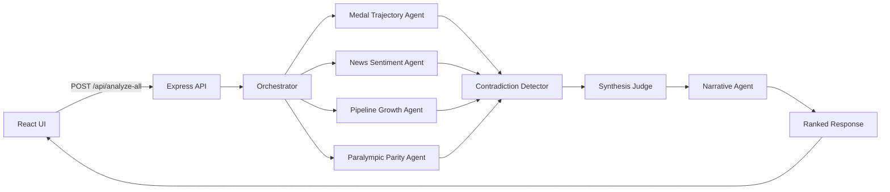

# Team USA LA28 Momentum Tracker

Team USA LA28 Momentum Tracker is a fan-facing hackathon app for the Team USA x Google Cloud Hackathon, built for Challenge 3: "The Road to LA28 Games Bracket." The app ranks Team USA sports by momentum using a multi-agent Gemini pipeline and presents the results in an editorial, analyst-style interface.

The app is deployed as a single Cloud Run service. Express serves both the API routes and the production React build. On page load, the frontend reads a cached momentum snapshot directly from Cloud Storage — so the public-facing experience never costs a Gemini call. The full agent pipeline runs on demand from the UI, on a scheduled cron route, and from a local admin script that refreshes the cached snapshot.

## Current Product State

The codebase currently includes:

- A React + Vite frontend with a hero, agent-status strip, tiered momentum board, and detail panel
- A Node.js + Express backend that serves both API routes and the production React build
- Deterministic momentum scoring in `server/utils/score.js`
- A legacy single-sport Gemini route at `POST /api/analyze`
- A multi-agent full-board route at `POST /api/analyze-all`
- A protected cron route at `POST /api/cron/orchestrate` that runs the full pipeline and writes results to Cloud Storage
- Firestore-backed agent memory: previous conclusions, article deduplication, and score history time series
- A public Cloud Storage object (`momentum-data.json`) read by the frontend on page load
- A local admin script (`npm run update:momentum-cache`) that runs the full pipeline and uploads the snapshot via `gsutil`
- Friendly UI error handling for quota, billing, API enablement, and network failures
- Google Cloud Run deployment with a GitHub Actions CI/CD workflow

Intentionally deferred:

- Live ingestion pipelines (the curated JSON file is still the source of truth for the agents)
- SSE or streaming agent updates
- Authentication, accounts, or admin tooling

## Read / Write Architecture

The deployment follows three strict rules:

1. **Page load reads from Cloud Storage only.** The frontend fetches `https://storage.googleapis.com/la28-momentum-cache/momentum-data.json` directly. Zero Gemini calls.
2. **Only the cron path (or the local admin script) writes to Cloud Storage.** Partial results are never written; the write only happens after the full pipeline succeeds.
3. **Live `/api/analyze-all` results stay in React state only.** Clicking "Refresh Rankings" reruns the agents and updates the UI but never touches Cloud Storage. Refreshing the page reverts to the cached snapshot.

If the cached object is missing or unreachable, the UI falls back to the local curated dataset returned by `GET /api/sports` and shows a "baseline data" banner.

## Frontend Experience

The current UI behaves like an AI analyst board:

- On page load it reads the cached momentum snapshot from Cloud Storage
- Sports are grouped into `High momentum`, `Rising`, and `Building` tiers
- A compact agent strip shows the multi-agent system progressing through the run
- A "Refresh Rankings" button reruns the full pipeline on demand
- The detail panel highlights the selected sport's composite score, confidence interval, agent signals, contradiction status, narrative, fan signal, LA28 outlook, and parity note
- User-facing failures are shown as friendly toast messages instead of raw backend errors
- Clicking a different sport dismisses any active toast so the interface recovers cleanly

## Agent Orchestration

The backend runs a seven-agent orchestration flow behind `POST /api/analyze-all` and `POST /api/cron/orchestrate`.



### Agent Responsibilities

- `orchestrator.js`: prepares the full analysis pass and the per-agent task list
- `medalTrajectory.js`: evaluates performance continuity and momentum trend framing
- `newsSentiment.js`: measures public visibility and headline energy from the curated dataset
- `pipelineGrowth.js`: evaluates developmental depth and future-facing pipeline strength
- `paralympicParity.js`: adds parity-aware reasoning so Paralympic sports are handled with equal seriousness
- `contradictionDetector.js`: flags meaningful disagreements between specialist signals and recommends weight adjustments
- `synthesisJudge.js`: merges agent outputs into ranked composite scores, tiers, and confidence intervals
- `narrative.js`: turns ranked synthesis into fan-friendly headlines, momentum stories, LA28 predictions, and tier emojis

### Runtime Flow

1. Run the orchestrator
2. Run four specialist agents in parallel
3. Run contradiction detection on the merged specialist outputs
4. Run the synthesis judge on the merged signals + contradictions
5. Run the narrative generator on the ranked synthesis
6. Return ranked output, raw agent output, contradictions, and timing metadata

The `POST /api/analyze-all` response includes:

- `ranked` — composite scores, tiers, narratives, fan signals, LA28 predictions, parity notes
- `agentOutputs` — raw outputs from each specialist plus the contradiction report
- `executionMeta.timingsMs` — per-stage and total timings

### Firestore-backed Agent Memory

The cron path persists state in Firestore so agents become time-aware across runs:

- `analyzed_articles` — fingerprinted articles (URL or headline+date hash) so news sentiment never re-counts the same story
- `agent_memory` — current and previous conclusions per `(sport, agent)` pair, with a change-reason
- `score_history` — rolling time series of composite scores per sport, capped at the most recent 52 data points, with a `changeFromLast` delta

The synthesis and narrative agents use `changeFromLast` to describe whether a sport is rising, falling, or holding steady since the previous run.

## Data Model and Scoring

The dataset lives at `server/data/sportsMomentum.json` and is labeled:

`curated public-data-inspired demo dataset`

Current coverage:

- 20 sports total
- 17 Olympic, 3 Paralympic
- Includes flag football, lacrosse, squash, and cricket
- Per-sport fields: news article summaries, trajectory hints, pipeline context, and "new Olympic sport" indicators

One important truth to keep visible: the prompt design aims for equal Olympic and Paralympic respect, but the current demo dataset is not yet fully category-balanced.

### Deterministic Momentum Score

`GET /api/sports` returns the curated dataset enriched with a deterministic score. The formula is:

```text
rawMomentumScore =
  worldChampionshipCount * 4 +
  recentHeadlineCount * 10 +
  growthSignalCount * 8 +
  parityBonus
```

Where:

- `parityBonus = 10` for Paralympic sports
- `parityBonus = 5` for Olympic sports

Raw scores are then normalized into a `0–100` range across the dataset and used for ranking and tier assignment.

The multi-agent `composite_score` returned by the synthesis judge is separate from this deterministic score; the deterministic score is used for the baseline UI and as a sanity rail.

## API Surface

### `GET /api/health`

Returns `{ ok: true }`.

### `GET /api/sports`

Returns the curated dataset with deterministic scores, score breakdowns, and rank metadata.

### `POST /api/analyze`

Legacy single-sport Gemini route kept for backward compatibility.

Request body:

```json
{ "sportId": "swimming" }
```

Returns `sportId`, `momentumScore`, and a structured `analysis` object.

### `POST /api/analyze-all`

Runs the full multi-agent pipeline and returns ranked output, raw agent outputs, contradictions, and timing metadata. Live results are not persisted.

### `POST /api/cron/orchestrate`

Protected cron endpoint. Runs the full pipeline, appends a new point to Firestore `score_history`, and writes the resulting `momentum-data.json` to Cloud Storage. Requires:

- `ENABLE_CRON_ORCHESTRATION=true`
- header `x-cron-secret: <CRON_SECRET>`

Returns `404` if cron is disabled and `401` if the secret is missing or wrong. Nothing is written if any agent step fails.

### Local Cloud Storage Refresh

To refresh the cached snapshot from a trusted local machine:

```bash
cd server
npm run update:momentum-cache
```

This runs the full agent pipeline locally and uploads the final result to:

```text
gs://la28-momentum-cache/momentum-data.json
```

The script only writes after the full pipeline succeeds. If any agent step fails, it exits without touching Cloud Storage.

The local machine needs Gemini credentials and authenticated `gsutil` access to the bucket. Application Default Credentials are also required if Firestore writes are part of the run.

If the command fails with `429`, Gemini quota was exhausted and the Cloud Storage object was left unchanged. Wait for quota to reset, switch `GEMINI_MODEL` or API key, or enable billing for the Gemini project before rerunning.

## How Gemini Is Used

Gemini is used only on the backend. The frontend never calls Gemini directly.

Current implementation details:

- `server/utils/gemini.js` exposes a reusable `callAgent()` helper used by every specialist
- All agents use structured JSON output (`responseMimeType: 'application/json'` + a JSON schema)
- The helper retries on `429`/`503` with exponential backoff and retries once with a higher token budget when the response is truncated and JSON parsing fails
- The model is configured through `GEMINI_MODEL`; the default is `gemini-2.5-flash` (the same value the production Cloud Run deploy uses)

The prompt behavior is intentionally constrained:

- analyze only the provided dataset
- do not invent athletes, medals, article titles, or exact results
- use cautious, conditional language ("could", "may", "might")
- do not guarantee future outcomes
- give Olympic and Paralympic sports equal analytical depth and respect

## Google Cloud Architecture

This project is designed to be simple to demo and simple to deploy:

- **Cloud Run** hosts the Node.js service (one container, one public URL)
- **Express** serves both the API and the production React build
- **Cloud Storage** hosts the cached `momentum-data.json` read by the frontend on page load
- **Firestore** stores agent memory, article deduplication, and score history (used by the cron path)
- **Gemini** is called only from the backend, only by the agents
- `PORT` is taken from Cloud Run at runtime
- `GEMINI_API_KEY`, `GEMINI_MODEL`, `GCS_BUCKET_NAME`, `GCS_FILE_NAME`, `ENABLE_CRON_ORCHESTRATION`, and `CRON_SECRET` are provided as environment variables

This keeps the deployment model lean: one container, one URL, no separate frontend hosting.

## CI/CD

The repo includes a GitHub Actions workflow at `.github/workflows/cloud-run-cicd.yml`.

Current intent:

- On pull requests to `main`, install dependencies, build the client, and validate that the dataset loads and produces numeric momentum scores
- On pushes to `main`, deploy to Cloud Run via `google-github-actions/deploy-cloudrun`
- Authenticate to Google Cloud through Workload Identity Federation

Repository configuration required:

- GitHub Secret: `GEMINI_API_KEY`
- GitHub Secret: `CRON_SECRET`
- GitHub Variable: `GCP_WIF_PROVIDER`
- GitHub Variable: `GCP_SERVICE_ACCOUNT`

The deploy step sets these environment variables on the Cloud Run service:

- `GEMINI_MODEL=gemini-2.5-flash`
- `GEMINI_API_KEY` (from secret)
- `GCS_BUCKET_NAME=la28-momentum-cache`
- `GCS_FILE_NAME=momentum-data.json`
- `ENABLE_CRON_ORCHESTRATION=true`
- `CRON_SECRET` (from secret)
- `FRONTEND_ORIGIN` for CORS

## Local Development

### Prerequisites

- Node.js 20+
- A Gemini API key
- Optional: `gsutil` and a Google Cloud project if you want to publish to the shared bucket
- Optional: Application Default Credentials if you exercise the Firestore-backed code paths

### Backend

```bash
cd server
npm install
cp .env.example .env
```

Recommended `server/.env`:

```bash
GEMINI_API_KEY=your_key_here
GEMINI_MODEL=gemini-2.5-flash
PORT=8080
FRONTEND_ORIGIN=http://localhost:5173
GCS_BUCKET_NAME=la28-momentum-cache
GCS_FILE_NAME=momentum-data.json
# Keep this off locally — only the deployed cron should be allowed to write to GCS.
ENABLE_CRON_ORCHESTRATION=false
```

Start the API:

```bash
npm run dev
```

### Frontend

```bash
cd client
npm install
npm run dev
```

By default:

- frontend runs at `http://localhost:5173`
- backend runs at `http://localhost:8080`

### Production Build

```bash
cd client
npm run build
```

Once `client/dist` exists, the Express server serves the built frontend automatically.

## Deploying to Cloud Run

The GitHub Actions workflow is the supported deploy path. For an ad-hoc deploy from the project root:

```bash
gcloud run deploy team-usa-la28-momentum \
  --source . \
  --region us-central1 \
  --allow-unauthenticated \
  --set-env-vars GEMINI_API_KEY=YOUR_GEMINI_API_KEY,GEMINI_MODEL=gemini-2.5-flash,GCS_BUCKET_NAME=la28-momentum-cache,GCS_FILE_NAME=momentum-data.json,ENABLE_CRON_ORCHESTRATION=true,CRON_SECRET=YOUR_CRON_SECRET
```

The service respects `process.env.PORT`, so it is Cloud Run compatible without extra runtime changes.

## Cloud Storage CORS

The cached `momentum-data.json` is fetched directly by the browser. The bucket needs a permissive CORS policy for `GET`. The reference policy is in `cors.json`:

```bash
gsutil cors set cors.json gs://la28-momentum-cache
```

## Project Structure

```text
team-usa-la28-momentum/
  .github/
    workflows/
      cloud-run-cicd.yml
  client/
    src/
      App.jsx
      api.js
      main.jsx
      styles.css
      us-flag.svg
    index.html
    package.json
    vite.config.js
  server/
    data/
      sportsMomentum.json
    scripts/
      seedBaselineCache.js
      updateMomentumCache.js
    utils/
      agents/
        orchestrator.js
        medalTrajectory.js
        newsSentiment.js
        pipelineGrowth.js
        paralympicParity.js
        contradictionDetector.js
        synthesisJudge.js
        narrative.js
      agentMemory.js
      gemini.js
      score.js
      storage.js
      trustedSources.js
    .env.example
    index.js
    package.json
  cors.json
  Dockerfile
  LICENSE
  README.md
  .dockerignore
  .gitignore
```

## Known Gaps and Deferred Work

- The curated local JSON file is still the only source of truth for the agents — no live ingestion yet
- No SSE or streaming response path for live agent progress
- The dataset is broader than the original MVP but still not fully parity-balanced across Olympic and Paralympic entries
- Cloud Scheduler is not yet wired up to call the cron route; the local admin script is the primary refresh mechanism today
- A handful of legacy frontend components from the MVP (`Bracket.jsx`, `Hero.jsx`, `Leaderboard.jsx`, `SportDetail.jsx`) still live under `client/src/components/` but are no longer imported by `App.jsx`

## Data Disclaimer

This app uses a curated public-data-inspired demo dataset. Gemini explains patterns from the provided data and does not guarantee future results, medal outcomes, or LA28 performance. The app is intended to help fans follow momentum signals, not to present deterministic predictions.
